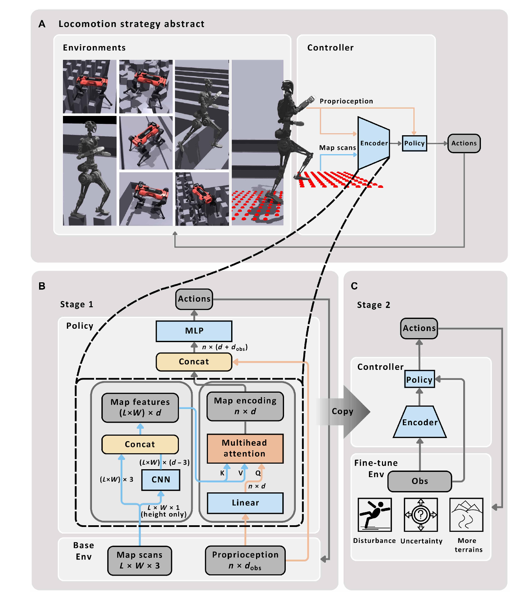
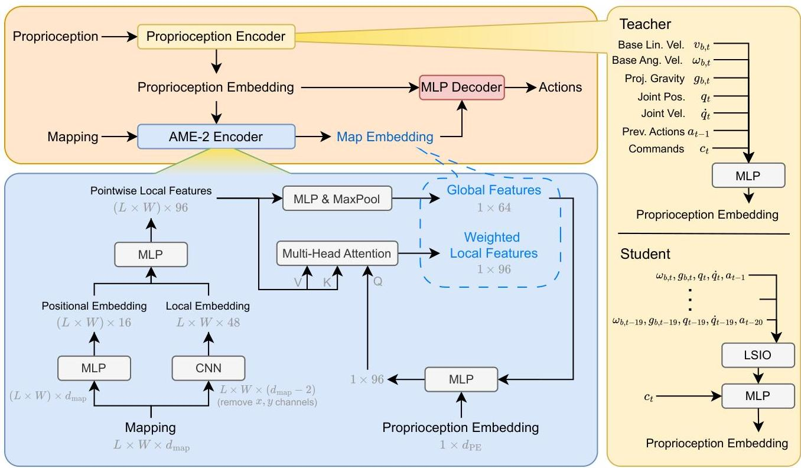
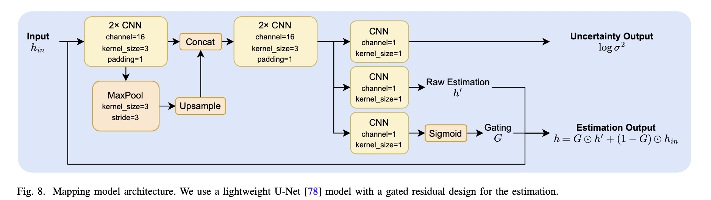

# AME

<video width="1080" controls src="../public/projects/ame/g1-stacks-ame2.mp4"></video>

## 算法详解

传统的腿足运动方法分为两大类，每类都有显著的局限性。依赖于显式地形映射和经典控制的基于模型的方法通常提供可解释性，但缺乏动态机动所需的敏捷性，并受限于计算约束。相反，端到端学习方法可以实现卓越的敏捷性，但通常在对未见环境的泛化方面表现不佳，并且其决策过程缺乏可解释性。
AME-2提出了第三条路径：一个基于学习的框架，它既保留了显式映射的可解释性优势，又实现了端到端方法的敏捷性和鲁棒性。该系统结合了三个关键创新：用于处理地形信息的基于注意力的神经网络架构、轻量级不确定性感知映射管道，以及促进实际部署的师生训练方案。

### 模型架构

AME-2的核心在于其基于注意力的地图编码架构，该架构处理高程地图以提取地形感知特征用于控制决策。该系统通过专用编码器处理本体感受信息（机器人状态、速度、关节位置）以及地形数据。

整体策略架构如上图图所示，其中AME-2编码器作为地图输入的核心特征提取器。我们使用本体感知编码器对本体感知观测进行编码，并由AME-2编码器基于本体感知嵌入对地图观测进行编码。随后，将本体感知嵌入和地图嵌入共同输入多层感知机（MLP），以输出动作。

AME-2编码器首先利用卷积神经网络（CNN）提取局部地图特征，并通过MLP为每个点计算位置嵌入；这些特征随后由另一个MLP进行融合，得到逐点局部特征。接下来，逐点局部特征经过一个额外的MLP处理后进行最大池化，生成刻画整体地形上下文的全局特征。我们将这些全局特征与本体感知嵌入通过一个MLP相结合，得到查询向量，并用于多头注意力（MHA）模块[63]，其中逐点局部特征作为键和值。这样可以根据当前本体感知状态和全局上下文，得到聚焦于重要地形区域的加权局部特征嵌入。最后，将全局特征与加权局部特征进行拼接，形成输入策略动作解码器的地图嵌入。

AME-2编码器通过以下几个阶段运行：

* 局部特征提取：一个CNN处理高程地图以生成点对点的局部特征，捕捉精细的地形细节。
* 全局上下文：一个MLP后接最大池化操作，提取代表整体地形特征的全局特征。
* 注意力机制：全局特征与本体感受信息结合形成一个用于多头注意力的查询向量，该向量根据相关性对局部特征进行加权。
* 特征整合：加权的局部特征与全局特征拼接，形成最终的地图嵌入。

这种架构允许机器人动态地将注意力集中在显著的地形区域，同时保持对更广阔环境上下文的感知。

### 训练方法

AME-2 采用复杂的教师-学生训练方案，旨在弥合仿真与现实之间的差距。教师策略首先使用地面真实仰角图和完美的本体感受信息进行训练，学习在不同地形上的敏捷运动技能。然后，学生策略学习使用神经映射管线来复制这些行为。

训练公式使用目标达成目标而非简单的速度跟踪，鼓励发展穿越地形的行为。奖励函数结合了：

* 任务奖励：朝向目标的姿态和航向跟踪
* 正则化：稳定性、平滑动作和能效
* 安全约束：避免关节限制并保持平衡

学生训练目标结合了多个损失项：

$$
L_{student} = L_{PPO} + \lambda_{action} L_{action} + \lambda_{repr} L_{repr}
$$

其中 $L_{PPO}$ 是标准 PPO 损失，$L_{action}$ 从教师那里提取动作，而 $L_{repr}$ 通过均方误差强制教师和学生地图嵌入之间的相似性。
训练过程中广泛的领域随机化包括机器人动力学变化、传感器噪声模拟和映射误差，以增强模拟到现实的迁移鲁棒性。

## Neural Mapping

### 建图流程

我们提出的神经建图流程如下图所示。它不仅可以在硬件上实现实时计算，而且可以在仿真中与数千个并行环境一起运行，从而通过相同的建图流程弥合仿真到现实的差距。

对于每个感知帧，我们将点云投影到一个局部二维高度网格。如果多个点落入同一个单元格，我们保留最大的 z 值，这对运动最相关，并为没有点的单元格分配一个固定的最小值。然而，由此产生的局部高程通常由于遮挡而嘈杂且不完整。为了缓解这个问题，我们使用一个通过贝叶斯学习训练的轻量级CNN来联合预测相对于基座的高程及其不确定性（以对数方差形式）。预测的不确定性捕捉了测量噪声和遮挡，而高程预测本身也可以抑制噪声。

然后，我们使用里程计姿态将这些局部预测融合到一个全局网格地图 M 中。它有两个层：高程层和不确定性层（以方差形式）。全局地图被初始化为机器人站立高度（相对于基座的地面高度）的平坦地面，并具有较大的不确定性。在每个新帧，给定带有不确定性的局部高程估计和当前基座姿态，我们将局部预测投影到全局网格单元。对于被局部网格覆盖的任何全局网格点 (u, v)，我们将新估计表示为 $h_t$，其不确定性为 $\sigma^2_t$，将它们与现有值 $h_{prior}$ 和 $\sigma^2_{prior}$ 融合。

我们不使用标准的贝叶斯融合，因为重复观测同一被遮挡或不确定的区域不应仅仅因为一致的预测而减少不确定性。相反，我们采用一种概率赢家通吃策略。首先，我们计算一个有效测量方差 $\hat{\sigma}^2_t$，该方差以先验为下界以防止过度自信：
$$
\hat{\sigma}^2_t = \max(\sigma^2_t , 0.5 \cdot \sigma^2_{prior}). \quad (6)
$$
只有当有效测量方差不明显大于先验（$\hat{\sigma}^2_t < 1.5\sigma^2_{prior}$），或者绝对不确定性较低（$\hat{\sigma}^2_t < 0.2^2$）时，更新才被认为是有效的。对于有效更新，我们基于相对精度确定覆盖地图的概率 $p_{win}$：
$$
p_{win} = \frac{(\hat{\sigma}^2_t )^{-1}}{(\hat{\sigma}^2_t )^{-1} + (\sigma^2_{prior})^{-1}}. \quad (7)
$$
最后，地图被随机更新。我们采样 $\xi \sim U[0, 1]$，如果样本落在概率阈值内，则让新预测接管该单元格：
$$
(h_{new}, \sigma^2_{new}) \leftarrow \begin{cases} (h_t, \hat{\sigma}^2_t) & \text{if } \xi < p_{win}, \\ (h_{prior}, \sigma^2_{prior}) & \text{otherwise}. \end{cases} \quad (8)
$$
对于控制器输入，我们只需在最新的全局地图中查询机器人姿态周围的网格。

这种概率赢家通吃策略提供了以下好处：
* 同一被遮挡点的不确定性不会通过一致的预测而降低。
* 过度自信的预测，如果不一致，则无法接管该单元格。
* 当有高置信度测量可用时，系统可以快速响应动态地形变化。
* 该流程易于与并行仿真集成，并且足够快以在硬件上运行。

### 学习局部建图模型

1) 地形与数据采样：我们使用运动训练地形网格和额外程序生成的地形来训练建图模型，

2) 训练数据合成：我们对采样的局部高程网格应用以下增强：
   * 在每个单元格上添加随机幅度的加性均匀噪声；
   * 从四个边框随机裁剪地图；
   * 使用随机传感器位置和视场角模拟遮挡；
   * 随机范围裁剪高程；
   * 以随机比例模拟随机缺失点和异常值。

通过这样做，我们合成了多样化的、嘈杂的、部分可观测的局部网格作为模型输入，并将原始的真实高程作为标签。

1) 模型与优化：我们训练模型以使用 [80] 中的 $\beta$-NLL 损失 $(\beta = 0.5)$ 重建真实高程：
$$
L_{0.5} = \mathbb{E}_{X, Y}\left[\mathrm{sg}\left[\hat{\sigma}(X)\right]\left(\frac{\log\hat{\sigma}^2(X)}{2} +\frac{(Y - \hat{\mu}(X))^2}{2\hat{\sigma}^2(X)}\right)\right], \quad (9)
$$
其中 $X$ 表示输入，$Y$ 表示真实高程，$\hat{\mu} (X)$ 和 $\hat{\sigma}^2 (X)$ 分别表示预测的估计和方差。算子 $\mathrm{sg}[\cdot ]$ 表示停止梯度操作。与经典贝叶斯学习 [51] 中使用的标准负对数似然（NLL）损失相比，这种公式减少了模型为了简单地减少损失而在困难样本上高估不确定性的趋势。它鼓励模型在无法进行准确预测时输出高不确定性，在可以进行准确预测时输出低不确定性并伴随准确预测，从而捕捉噪声和遮挡。

对于批处理优化，不同样本的地形粗糙度可能差异很大。因此，平坦地形可能主导批次损失，并减少对具有挑战性案例的有效重视。为了缓解这个问题，我们在训练期间使用其总变差（TV）[81] 对每批中的样本进行重新加权：
$$
\begin{array}{c}{\mathrm{TV}(Y_b) = \frac{1}{HW}\Big(\| \nabla_xY_b\| _1 + \| \nabla_yY_b\| _1\Big), }\\ {w_b = \frac{\mathrm{TV}(Y_b)}{\sum_{b' = 1}^{B}\mathrm{TV}(Y_{b'}) + \epsilon}.} \end{array} \quad (10)
$$
这里，$Y_{b}$ 是批次中第 $b$ 个样本的真实高程，$H$ 和 $W$ 是高度和宽度。权重 $w_{b}$ 在批次上进行归一化，$\epsilon$ 是一个小的正常数。通过这样做，我们为具有较大高程变化的样本分配更高的权重。

我们使用一个带有门控残差设计的浅层 U-Net 模型，如下图所示。CNN输出不确定性、原始估计和一个门控图。最终估计通过原始估计和输入的门控组合获得，在清晰观测的区域保持准确性，同时选择性覆盖噪声或遮挡区域。

我们为每个机器人训练模型，使用 5400 万帧，每个模型在不到 1 小时内收敛。

## MDP

### Rewards

| 奖励                       | 公式                                                         | 权重                 |
| -------------------------- | ------------------------------------------------------------ | -------------------- |
| Linear velocity tracking   | $exp({-\lVert v^{*}_{xy, j} - v_{xy, j}\rVert})$             | 5.0                  |
| Angular velocity tracking  | $exp({-\lVert \omega^{*}_{z, j} - \omega_{z, j}\rVert})$     | 3.0                  |
| Termination peanlty        | $-n_{termination}$                                           | 200                  |
| Collision peanlty          | $-n_{collision, j}$                                          | 1                    |
| Action rate                | $-\lVert a_{jt} = a_{jt-1}\rVert^2$                          | $5.0 \times 10^{-3}$ |
| Joint acceleration penalty | $-\lVert \ddot{q}_{j}\rVert^{2}$                             | $2.5 \times 10^{-7}$ |
| Joint torque penalty       | $-\lVert \tau_{j} \rVert^{2}$                                | $2.0 \times 10^{-5}$ |
| Joint position limits      | $-\max(\lvert q_j \rvert - 0.9q_{lim, j}, \; 0)$             | 1.0                  |
| Joint velocity limits      | $-\max(\lvert \dot{q}_j \rvert - 0.9\dot{q}_{lim, j}, \; 0)$ | 1.0                  |
| Joint torque limits        | $-\max(\lvert \tau_j \rvert - 0.9\tau_{lim, j}, \; 0)$       | 0.2                  |
| Linear velocity penalty    | $-v_{z, i^{*}}^{2}$                                          | 1.0                  |
| Angular velocity penalty   | $-\lVert \omega_{xy, i}\rVert^{2}$                           | $5.0 \times 10^{-2}$ |
| Contact force penalty      | $-max(\lVert F_f\rVert - 700, 0)$                            | $2.5 \times 10^{-5}$ |
| Foot slippage penalty      | $-c_{f}^{*}\lVert v_f\rVert$                                 | 0.5                  |
| Joint deviation penalty    | $max(\lVert q_j - q_{0, j}\rVert^{2}-0.25, 0.0)$             | 0.5                  |
| No fly                     | $-n_{zero\_contact}$                                         | 5.0                  |
| Straight body              | $-\lVert g_i\rVert^2$                                        | 3.0                  |

### Observations

| Observation          | 公式          | Shape                 | Actor | Critic |
| -------------------- | ------------- | --------------------- | ----- | ------ |
| Base linear velocity | $v_b$         |                       | N     | Y      |
| Angular velocity     | $\omega_b$    |                       | Y     | Y      |
| Gravity vector       | $g_b$         |                       | Y     | Y      |
| Joint positions      | $q_j$         |                       | Y     | Y      |
| Joint velocities     | $\dot{q}_j$   |                       | Y     | Y      |
| Previous actions     | $a_{t-1}$     |                       | Y     | Y      |
| Velocity commands    | $V_{command}$ |                       | Y     | Y      |
| vector map scans     | $m$           | $L \times W \times 3$ | Y     | Y      |

### Sim2Real(域随机化)

1. startup
   1. randomize rigid body material
   2. randomize bass mass
   3. randomize base com
2. reset
   1. apply external force torque
   2. reset root state uniform
   3. reset joints by scale
3. interval
   1. push by setting velocity

## 不同地形下仿真演示

<video controls src="../public/projects/ame/g1-rails-ame2.mp4" title="Title"></video>
<video controls src="../public/projects/ame/g1-pyramid_stairs-ame2.mp4" title="Title"></video>
<video controls src="../public/projects/ame/g1-hf_gaps-ame2.mp4" title="Title"></video>
