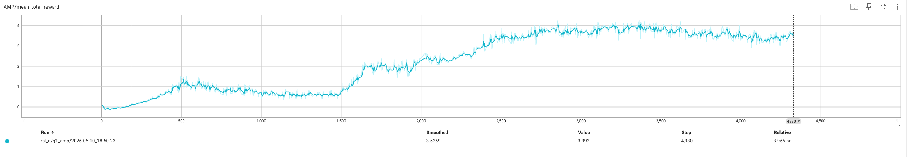

# AMP

<video width="1080" controls src="../public/projects/amp/amp-demo.mp4"></video>

## 一、基本原理

AMP（Adversarial Motion Priors，对抗运动先验）的核心思想是将角色运动的“风格”从非结构化参考运动数据中学习为一种可微的奖励先验，从而把任务目标与运动风格解耦。给定参考运动数据集 $\mathcal{M}$，其中每条运动 $\mathbf{m}^i=\{\hat{\mathbf{q}}_t^i\}$ 是姿态序列，系统并不要求策略逐步跟踪某一特定参考运动，而是训练一个对抗判别器 $D$，使其区分来自数据集的真实状态转移 $(s, s')$ 与由策略产生的虚假状态转移。判别器输出的相似度经变换后作为风格奖励 $r^S$，与任务奖励 $r^G$ 线性组合，形成总体奖励：
$$
r(s_t, a_t, s_{t+1}, g)=w^G r^G(s_t, a_t, s_{t+1}, g)+w^S r^S(s_t, s_{t+1}).
$$
其中 $w^G$ 与 $w^S$ 分别为任务奖励和风格奖励的权重。任务奖励负责指定“做什么”，例如以目标速度沿目标方向行走、移动到目标位置、运球或击打目标；风格奖励负责指定“如何做”，例如采用行走、奔跑、僵尸步态或潜行步态。由于风格奖励不依赖具体任务目标 $g$，同一个运动先验可服务于多个任务，不同运动先验也可用于同一任务的不同风格。策略在目标条件强化学习框架下最大化期望折扣回报：
$$
J(\pi)=\mathbb{E}_{\rho(g)}\mathbb{E}_{\rho(\tau|\pi, g)}\left[\sum_{t=0}^{T-1} r_t\right], 
$$
其中 $\tau$ 为轨迹，$\pi(a_t|s_t, g)$ 为策略，$g$ 为目标。通过将对抗运动先验嵌入该框架，角色能够在完成高层任务的同时自动组合、插值并泛化参考数据中的多种运动技能，而无需运动规划器或对运动片段进行任务特定标注与选择。

## 二、方法设计

AMP 采用生成对抗模仿学习（GAIL）的思想，但由于参考运动数据通常只包含状态而不包含演示动作，判别器被设计为状态转移判别器 $D(s, s')$。其原始对抗目标可写为
$$
\arg\min_D -\mathbb{E}_{d^{\mathcal{M}}(s, s')}[\log D(s, s')]-\mathbb{E}_{d^{\pi}(s, s')}[\log(1-D(s, s'))], 
$$
其中 $d^{\mathcal{M}}$ 与 $d^{\pi}$ 分别表示数据集和策略的状态转移分布。为缓解 sigmoid 交叉熵在饱和区导致的梯度消失和训练不稳定问题，AMP 采用最小二乘 GAN 目标：
$$
\arg\min_D \mathbb{E}_{d^{\mathcal{M}}(s, s')}[(D(s, s')-1)^2]+\mathbb{E}_{d^{\pi}(s, s')}[(D(s, s')+1)^2].
$$
判别器对数据集样本输出接近 $1$，对策略样本输出接近 $-1$。进一步地，判别器并不直接作用于完整状态，而是先通过观测映射 $\Phi(s)$ 提取与运动风格相关的紧凑特征，即 $D(\Phi(s), \Phi(s'))$。这些特征包括根节点的局部线速度与角速度、各关节的局部旋转、各关节的局部速度以及末端执行器（手、脚等）在角色局部坐标系中的 3D 位置；根节点定义为骨盆，局部坐标系原点位于根节点，$x$ 轴沿根节点朝向，$y$ 轴与全局上方向对齐。球关节的 3D 旋转使用 normal-tangent 的 6D 编码表示，以保证平滑且唯一的旋转表示。由于观测特征不包含任务特定信息，运动先验可在无任务标注的情况下训练，并可跨任务复用。

为了进一步提升训练稳定性，AMP 在判别器目标中加入梯度惩罚，惩罚真实数据流形上的非零梯度，避免生成器因判别器近似误差而偏离数据流形。加入梯度惩罚后的判别器目标为
$$
\begin{aligned}
\arg\min_D\; &\mathbb{E}_{d^{\mathcal{M}}(s, s')}\left[(D(\Phi(s), \Phi(s'))-1)^2\right]\\
&+\mathbb{E}_{d^{\pi}(s, s')}\left[(D(\Phi(s), \Phi(s'))+1)^2\right]\\
&+\frac{w^{SD}}{2}\mathbb{E}_{d^{\mathcal{M}}(s, s')}\left[\left\|\nabla_{\phi}D(\phi)\big|_{\phi=(\Phi(s), \Phi(s'))}\right\|^2\right], 
\end{aligned}
$$
其中 $w^{SD}$ 为梯度惩罚系数。判别器给出的风格奖励由下式变换得到：
$$
r^S(s_t, s_{t+1})=\max\left[0, 1-0.25\left(D(\Phi(s_t), \Phi(s_{t+1}))-1\right)^2\right].
$$
该式将判别器输出映射到 $[0, 1]$ 区间，作为策略训练时的风格奖励。策略与值函数采用 PPO 与 GAIL 联合训练：值函数使用 TD($\lambda$) 更新，策略使用 GAE($\lambda$) 计算优势并更新；判别器则从参考运动数据集与策略轨迹回放缓冲区中采样状态转移进行更新。回放缓冲区有助于防止判别器过拟合到策略最近产生的轨迹。

在模型表示方面，状态 $s_t$ 包括各连杆相对根节点的位置、以 6D normal-tangent 编码表示的连杆旋转，以及线速度和角速度，所有特征均在角色局部坐标系中记录。与依赖相位变量或目标姿态同步的跟踪式方法不同，AMP 的策略不需要与某一参考运动同步，因此状态中不包含相位变量或目标姿态。动作 $a_t$ 指定各关节 PD 控制器的目标位置；对于球关节，目标以 3D 指数映射 $\mathfrak{q}\in\mathbb{R}^3$ 表示，其旋转轴与旋转角分别为
$$
\mathbf{v}=\frac{\mathbf{q}}{\|\mathbf{q}\|_2}, \qquad \theta=\|\mathbf{q}\|_2.
$$
该参数化比四元数或轴角表示更紧凑，并可避免欧拉角的万向锁问题。策略网络输出高斯分布 $\pi(a_t|s_t, g)=\mathcal{N}(\mu(s_t, g), \Sigma)$，均值由全连接网络给出，协方差矩阵固定。值函数与判别器采用类似网络结构。

## 三、训练流程

训练开始时，初始化判别器 $D$、策略 $\pi$、值函数 $V$ 以及回放缓冲区 $\mathcal{B}$。在每一轮迭代中，首先使用当前策略与环境交互，收集若干条轨迹。对轨迹中的每个时间步 $t$，将状态转移 $(\Phi(s_t), \Phi(s_{t+1}))$ 输入判别器，得到判别分数 $d_t=D(\Phi(s_t), \Phi(s_{t+1}))$，再根据上式风格奖励公式计算 $r_t^S$。同时从环境中获得任务奖励 $r_t^G$。随后按总体奖励公式组合 $r_t=w^G r_t^G+w^S r_t^S$，并记录到轨迹中。收集完成后，将轨迹存入回放缓冲区 $\mathcal{B}$。

判别器的更新从参考运动数据集 $\mathcal{M}$ 中采样一批真实状态转移，并从回放缓冲区 $\mathcal{B}$ 中采样一批策略状态转移，按照带梯度惩罚的最小二乘目标更新判别器。该过程可重复若干步。随后，使用本轮收集的轨迹数据更新值函数 $V$ 与策略 $\pi$。值函数以 TD($\lambda$) 目标更新，策略以 GAE($\lambda$) 优势通过 PPO 更新。上述过程循环进行，直至训练结束。由于风格奖励直接作用于策略产生的运动，AMP 能够自动从数据集中选择、插值和组合合适的行为，而无需显式的运动选择机制或高层运动规划器。

## 四、伪代码

<pre class="pseudocode">
\documentclass{article}
\usepackage{algorithm}
\usepackage{algpseudocode}
\usepackage{amsmath}
\usepackage{amssymb}
\usepackage{bm}

\begin{document}

\begin{algorithm}
\caption{Training with AMP}
\begin{algorithmic}[1]
\Require $\mathcal{M}$: dataset of reference motions
\State $D \leftarrow$ initialize discriminator
\State $\pi \leftarrow$ initialize policy
\State $V \leftarrow$ initialize value function
\State $\mathcal{B} \leftarrow \emptyset$ initialize replay buffer

\While{not done}

    \For{trajectory $i = 1, \dots, m$}
        \State $\tau^i \leftarrow \{(s_t, a_t, r_t^G)_{t=0}^{T-1}, s_T^G, g\}$ collect trajectory with $\pi$
        \For{time step $t = 0, \dots, T - 1$}
            \State $d_t \leftarrow D(\Phi(s_t), \Phi(s_{t+1}))$
            \State $r_t^S \leftarrow$ calculate style reward according to Equation 7 using $d_t$
            \State $r_t \leftarrow w^G r_t^G + w^S r_t^S$
            \State record $r_t$ in $\tau^i$
        \EndFor
        \State store $\tau^i$ in $\mathcal{B}$
    \EndFor

    \For{update step $= 1, \dots, n$}
        \State $b^{\mathcal{M}} \leftarrow$ sample batch of $K$ transitions $\{(s_j, s_j')\}_{j=1}^K$ from $\mathcal{M}$
        \State $b^{\pi} \leftarrow$ sample batch of $K$ transitions $\{(s_j, s_j')\}_{j=1}^K$ from $\mathcal{B}$
        \State update $D$ according to Equation 8 using $b^{\mathcal{M}}$ and $b^{\pi}$
    \EndFor

    \State update $V$ and $\pi$ using data from trajectories $\{\tau^i\}_{i=1}^m$

\EndWhile
\end{algorithmic}
\end{algorithm}

\end{document}
</pre>

Equation 7:

$$
r(s_t, s_{t+1}) = max[0, 1 - 0.25(D(s_t, s_{t+1}) - 1)^2]
$$

Equation 8:

$$
\begin{align}
\argmin_{D} \mathbb{E}_d^M(s, s^{\prime})[(D(\Phi(s), \Phi(s^{\prime})) - 1)^2] + \\ 
\mathbb{E}_d^{\pi}(s, s^{\prime})[(D(\Phi(s), \Phi(s^{\prime})) + 1)^2] + \\
\frac{w^{GP}}{2} \cdot \mathbb{E}_{d^{M}(s, s^{\prime})}[\lVert \nabla_{\phi} D(\phi)\lvert_{\phi = (\Phi(s), \Phi(s^{\prime}))} \rVert_2^2]
\end{align}
$$

## 实验设置

### 训练数据集

实验从 AMASS 数据集中选取了多段行走, 跑步和转弯的数据集, 包含慢速走, 快跑, 左转弯, 右转弯, 行走切换到跑步等.

1. 倒着走

<video width="1080" controls src="../public/projects/amp/unitree_g1_B4_-_Stand_to_Walk_backwards_stageii.mp4"></video>

2. 右转弯跑

<video width="1080" controls src="../public/projects/amp/unitree_g1_C14_-__run_turn_right__(90)_stageii.mp4"></video>

3. 不同方向跑

<video width="1080" controls src="../public/projects/amp/unitree_g1_C17_-_run_change_direction_stageii.mp4"></video>

4. 跳步

<video width="1080" controls src="../public/projects/amp/unitree_g1_Run_C25_-_quick_side_step_right_stageii.mp4"></video>

5. 网球发球

<video width="1080" controls src="../public/projects/amp/unitree_g1_hmr4d_results.mp4"></video>

### 训练结果

<video width="1080" controls src="../public/projects/amp/amp-demo.mp4"></video>

#### 关键曲线

### MDP

### Observations

Observations 分成三部分: actor, critic 和 discriminator 的输入，分别对应强化学习中的策略网络、价值网络和对抗判别器。

1. Actor Observations

| Name                    | Description                                  |
| ----------------------- | -------------------------------------------- |
| base_ang_vel            | 机器人基座的角速度                           |
| root_local_rot_tan_norm | 机器人根节点的局部旋转，使用 tanh 归一化表示 |
| velocity_commands       | 机器人接收到的速度指令，包含线速度和角速度   |
| joint_pos               | 机器人所有关节的当前角度位置                 |
| joint_vel               | 机器人所有关节的当前角速度                   |

2. Critic Observations

| Name                    | Description                                  |
| ----------------------- | -------------------------------------------- |
| base_lin_vel            | 机器人基座的线速度                           |
| base_ang_vel            | 机器人基座的角速度                           |
| root_local_rot_tan_norm | 机器人根节点的局部旋转，使用 tanh 归一化表示 |
| velocity_commands       | 机器人接收到的速度指令，包含线速度和角速度   |
| joint_pos               | 机器人所有关节的当前角度位置                 |
| joint_vel               | 机器人所有关节的当前角速度                   |
| actions                 | 机器人所有关节的动作指令                     |
| key_body_pos_b          | 机器人关键身体部位（如手、脚等）的 3D 位置   |

3. Discriminator Observations

| Name         | Description                  |
| ------------ | ---------------------------- |
| base_ang_vel | 机器人基座的角速度           |
| joint_pos    | 机器人所有关节的当前角度位置 |
| joint_vel    | 机器人所有关节的当前角速度   |

### Event

| Stage    | Event Name                    | Description                                                                                      |
| -------- | ----------------------------- | ------------------------------------------------------------------------------------------------ |
| statrup  | randomize_rigid_body_material | 在仿真环境启动时，随机化机器人和地面的物理材质属性，如摩擦系数、弹性等，以增加训练的鲁棒性。     |
| startup  | randomize_rigid_body_mass     | 在仿真环境启动时，随机化机器人各个部件的质量属性，以增加训练的鲁棒性。                           |
| reset    | apply_external_force_torque   | 在环境重置时，向机器人施加随机的外部力或力矩，以增加训练的鲁棒性。                               |
| reset    | reset_from_ref                | 在环境重置时，将机器人的状态随机初始化为运动数据集中的一个参考状态，以增加训练的多样性和稳定性。 |
| interval | push_by_setting_velocity      | 在训练过程中，定期根据预设的速度指令向机器人施加推力，以引导其学习特定的运动模式。               |

### Rewards

| Name                 | Description                                                                                                                  |
| -------------------- | ---------------------------------------------------------------------------------------------------------------------------- |
| track_lin_vel_xy_exp | 线速度跟踪奖励，基于机器人在水平面上的线速度与目标速度的指数距离计算，鼓励机器人以正确的速度移动。                           |
| track_ang_vel_z_exp  | 角速度跟踪奖励，基于机器人绕垂直轴的角速度与目标角速度的指数距离计算，鼓励机器人以正确的角速度旋转。                         |
| lin_vel_z_l2         | 垂直线速度奖励，基于机器人在垂直方向上的线速度的 L2 范数计算，鼓励机器人保持适当的垂直运动。                                 |
| ang_vel_xy_l2        | 水平角速度奖励，基于机器人绕水平轴的角速度的 L2 范数计算，鼓励机器人保持适当的水平旋转。                                     |
| dof_torques_l2       | 关节力矩奖励，基于机器人所有关节的力矩指令的 L2 范数计算，鼓励机器人使用较小的力矩来完成任务。                               |
| action_rate_l2       | 动作变化率奖励，基于机器人所有关节的动作指令与前一时间步的动作指令之间的 L2 范数计算，鼓励机器人动作平滑。                   |
| feet_air_time        | 脚部空中时间奖励，基于机器人脚部离地的时间计算，鼓励机器人保持适当的步态和空中时间。                                         |
| undesired_contacts   | 不期望接触奖励，基于机器人与环境中不期望接触的数量计算，鼓励机器人避免与环境中的障碍物或地面发生不必要的接触。               |
| flat_orientation_l2  | 平坦姿态奖励，基于机器人根节点的局部旋转与水平姿态之间的 L2 范数计算，鼓励机器人保持平坦的姿态。                             |
| dof_pos_limits       | 关节位置限制奖励，基于机器人所有关节的当前角度位置与预设的关节位置限制之间的 L2 范数计算，鼓励机器人保持在合理的关节范围内。 |

### Terminations

| Name            | Description                                                                      |
| --------------- | -------------------------------------------------------------------------------- |
| time_out        | 当训练环境中的时间步数达到预设的最大值时，训练回合结束。                         |
| base_contact    | 当机器人基座与地面发生接触时，训练回合结束。                                     |
| base_height     | 当机器人基座的高度低于预设的最小值时，训练回合结束。                             |
| bad_orientation | 当机器人根节点的局部旋转与水平姿态之间的 L2 范数超过预设的阈值时，训练回合结束。 |

## AMP 训练

### AMP 关键参数

| 参数名称           | 值          | 备注                     |
| ------------------ | ----------- | ------------------------ |
| learning rate      | 0.0001      | -                        |
| 判别器 hidden dims | [1024, 512] | MLP                      |
| style reward scale | 5.0         | 风格奖励的权重           |
| task style lerp    | 0.3         | 任务奖励和风格奖励的平衡 |
| loss type          | LSGAN       | 最小二乘 GAN             |

## 附录

### Unitree G1 Joints

| Index | Joint Name                  |
| ----- | --------------------------- |
| 0     | left_hip_pitch_joint        |
| 1     | right_hip_pitch_joint       |
| 2     | waist_yaw_joint             |
| 3     | left_hip_roll_joint         |
| 4     | right_hip_roll_joint        |
| 5     | waist_roll_joint            |
| 6     | left_hip_yaw_joint          |
| 7     | right_hip_yaw_joint         |
| 8     | waist_pitch_joint           |
| 9     | left_knee_joint             |
| 10    | right_knee_joint            |
| 11    | left_shoulder_pitch_joint   |
| 12    | right_shoulder_pitch_joint  |
| 13    | left_ankle_pitch_joint      |
| 14    | right_ankle_pitch_joint     |
| 15    | left_shoulder_roll_joint    |
| 16    | right_shoulder_roll_joint   |
| 17    | left_ankle_roll_joint       |
| 18    | right_ankle_roll_joint      |
| 19    | left_shoulder_yaw_joint     |
| 20    | right_shoulder_yaw_joint    |
| 21    | left_elbow_joint            |
| 22    | right_elbow_joint           |
| 23    | left_wrist_roll_joint       |
| 24    | right_wrist_roll_joint      |
| 25    | left_wrist_pitch_joint      |
| 26    | right_wrist_pitch_joint     |
| 27    | left_wrist_yaw_joint        |
| 28    | right_wrist_yaw_joint       |
