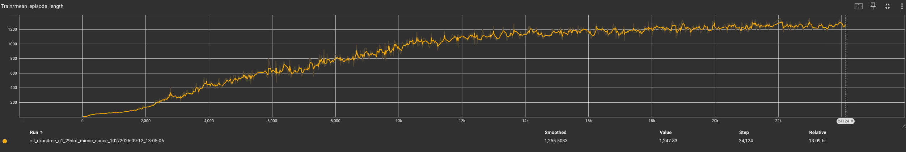
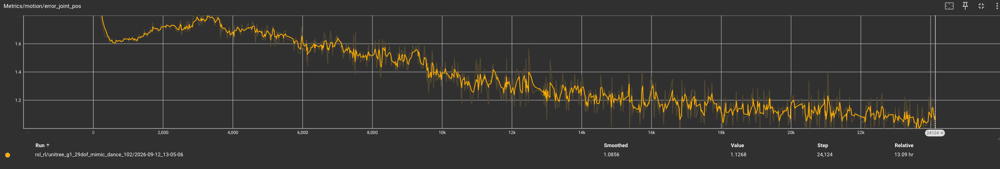

# BeyondMimic

<video width="1080" controls src="../public/projects/P2_play.mp4"></video>

BeyondMimic 的核心思想在于将人形机器人控制分解为两个相互衔接的阶段：第一阶段通过可扩展的强化学习运动跟踪，从无标签人类运动数据中习得大量具有人类敏捷性与自然性的原子技能；第二阶段将已习得的运动跟踪策略蒸馏到潜在空间，并在该潜在空间上训练状态—动作扩散模型，从而利用扩散模型对数据分布梯度的建模能力，在推理阶段通过分类器引导实现在线任务优化。由此，系统无需针对下游任务重新训练或微调，即可完成速度跟踪、路点导航、摇杆遥操作、运动补间与避障等未见任务，并在真实人形机器人上实现零样本部署。

## 一、总体原理

设机器人运动跟踪问题为一个马尔可夫决策过程，其状态、动作与奖励均由统一的、与具体运动无关的公式定义。对于一段人类重定向参考运动，记其逐帧广义位置与速度分别为

$$
\mathbf{q}^{\mathrm{ref}}=(\mathbf{p}^{\mathrm{ref}}, R^{\mathrm{ref}}, \boldsymbol{\theta}^{\mathrm{ref}})\in\mathbb{R}^{3}\times \mathbf{SO}(3)\times\mathbb{R}^{n_{\mathrm{jnt}}}, 
$$

$$
\mathbf{v}^{\mathrm{ref}}=(\mathbf{v}^{\mathrm{ref}}, \boldsymbol{\omega}^{\mathrm{ref}}, \dot{\boldsymbol{\theta}}^{\mathrm{ref}})\in\mathbb{R}^{3}\times\mathbb{R}^{3}\times\mathbb{R}^{n_{\mathrm{jnt}}}.
$$

其中 $n_{\mathrm{jnt}}$ 为机器人关节数。通过前向运动学可得到各刚体 $b\in\mathcal{B}$ 的位姿 $T_b^{\mathrm{ref}}=(\mathbf{p}_b^{\mathrm{ref}}, R_b^{\mathrm{ref}})$ 与旋量 $\mathcal{V}_b^{\mathrm{ref}}=(\mathbf{v}_b^{\mathrm{ref}}, \boldsymbol{\omega}_b^{\mathrm{ref}})$。为避免相邻连杆冗余，选取目标刚体集合 $\mathcal{B}_{\mathrm{target}}\subset\mathcal{B}$，其中末端执行器集合为 $\mathcal{B}_{\mathrm{ee}}\subseteq\mathcal{B}_{\mathrm{target}}$。

为了在扰动与仿真到现实差异下允许全局漂移，同时保持运动风格，策略并不直接跟踪全局绝对位姿，而是跟踪以锚点刚体 $b_{\mathrm{anchor}}$ 为中心的相对位姿。锚点自身直接跟随参考：

$$
T_{\mathrm{anchor}}^{\mathrm{des}}=T_{\mathrm{anchor}}^{\mathrm{ref}}.
$$

对于非锚点刚体 $b\neq b_{\mathrm{anchor}}$，其期望位姿由参考位姿经偏航对齐、高度保持的变换 $\mathcal{A}(\cdot)$ 得到：

$$
T_b^{\mathrm{des}}=\mathcal{A}\left(T_b^{\mathrm{ref}}, T_{\mathrm{anchor}}\right), 
$$

而期望旋量保持不变：

$$
\mathcal{V}_b^{\mathrm{des}}=\mathcal{V}_b^{\mathrm{ref}}.
$$

由此，运动跟踪目标为

$$
\{T_{\mathrm{anchor}}^{\mathrm{des}}, \mathcal{V}_{\mathrm{anchor}}^{\mathrm{des}}, \{T_b^{\mathrm{des}}, \mathcal{V}_b^{\mathrm{des}}\}_{b\in\mathcal{B}_{\mathrm{target}}}\}.
$$

该设计既保留了运动风格，又允许良性全局漂移，从而提升鲁棒性与仿真到现实迁移能力。

## 二、第一阶段：可扩展运动跟踪的强化学习方法

第一阶段使用统一的强化学习配方训练每个运动的跟踪策略。其观测空间为连续、机器人中心式表示，且不进行时间堆叠：

$$
\mathbf{o}=[\psi, \mathbf{e}_{\mathrm{anchor}}, \mathcal{V}_{\mathrm{imu}}, \theta-\theta^{0}, \dot{\theta}, \mathbf{a}_{\mathrm{last}}].
$$

其中 $\psi=[\theta^{\mathrm{ref}}, \dot{\theta}^{\mathrm{ref}}]$ 为运动相位，仅作为进度提示；$\mathbf{e}_{\mathrm{anchor}}\in\mathbb{R}^{9}$ 为锚点位姿误差，包含位置误差与由旋转误差矩阵前两列构成的 6D 方向误差；$\mathcal{V}_{\mathrm{imu}}\in\mathbb{R}^{6}$ 为 IMU 坐标系下的旋量；$\theta-\theta^{0}$ 与 $\dot{\theta}$ 分别为相对默认关节位置与关节速度；$\mathbf{a}_{\mathrm{last}}$ 为上一时刻动作。动作定义为归一化关节位置设定点：

$$
\theta^{\mathrm{sp}}=\theta^{0}+\alpha\odot\mathbf{a}, 
$$

其中 $\mathbf{a}\in\mathbb{R}^{n_{\mathrm{joint}}}$ 为策略输出，$\alpha$ 为逐关节动作尺度，$\odot$ 表示逐元素乘积。该设定点作为位置 PD 控制器的指令，用于生成关节力矩，而非高精度位置目标。

奖励函数由统一任务项与三个正则项组成：

$$
r=r_{\mathrm{task}}-\lambda_l r_{\mathrm{limit}}-\lambda_s r_{\mathrm{smooth}}-\lambda_c r_{\mathrm{contact}}.
$$

任务项对所有目标刚体的位置、方向、线速度与角速度误差进行高斯型指数映射：

$$
r_{\mathrm{task}}=\sum_{s\in\{\mathbf{p}, R, \mathbf{v}, \boldsymbol{\omega}\}}r(\bar{e}_s, \sigma_s), 
$$

其中

$$
r(\bar{e}_s, \sigma_s)=\exp\left(-\bar{e}_s/\sigma_s^2\right), 
$$

而 $\bar{e}_s$ 为各目标刚体上对应误差的均方值。正则项分别为关节限位惩罚

$$
r_{\mathrm{limit}}=\sum_{j=1}^{N_j}\left[\max(l_j-\theta_j, 0)+\max(\theta_j-u_j, 0)\right], 
$$

动作平滑惩罚

$$
r_{\mathrm{smooth}}=\|\mathbf{a}_t-\mathbf{a}_{t-1}\|_2, 
$$

以及自接触惩罚

$$
r_{\mathrm{contact}}=\sum_{b\notin\mathcal{B}_{\mathrm{ee}}}\mathbf{1}\left[\|\mathbf{f}_b^{\mathrm{self}}\|>f_{\mathrm{th}}\right].
$$

训练中使用有限的域随机化，仅对真实不确定物理属性进行随机化，包括接触摩擦、恢复系数、默认关节位置偏移、躯干质心偏移以及周期性根速度扰动。为提升长序列中困难片段的训练效率，采用自适应采样：将参考运动划分为 $S$ 个一秒区间，每个区间的失败率用指数滑动平均更新：

$$
\bar{f}_s\leftarrow 0.999\bar{f}_s+0.001f_s.
$$

随后加入均匀底噪 $\bar{f}_s\leftarrow\bar{f}_s+0.1/S$，并施加非因果指数衰减核 $k(u)=\rho^u$，得到采样概率

$$
p_s=\frac{\sum_{u=0}^{K-1}\rho^u\bar{f}_{s+u}}{\sum_{j=1}^{S}\sum_{u=0}^{K-1}\rho^u\bar{f}_{j+u}}.
$$

最终按归一化概率 $\hat{p}_s=p_s/\sum_j p_j$ 进行多项式采样，以选择回合初始相位。

## 三、第二阶段：潜在状态—动作扩散模型

第二阶段的目标是学习人类运动跟踪策略所产生的状态—动作轨迹分布，并在推理时通过任务成本引导生成新轨迹。直接对原始动作空间进行扩散并不稳定，因为 PD 设定点包含尖锐力矩尖峰且不规则；同时大扩散网络会带来不可忽略的推理延迟。因此，BeyondMimic 采用潜在扩散模型：先训练一个条件变分自编码器，将运动跟踪策略压缩到平滑、结构化的潜在空间，再在该潜在空间上训练状态—潜变量扩散模型。

VAE 的编码器仅接收参考运动相关分量：

$$
\mathbf{z}=\mathcal{E}(\boldsymbol{\psi}, \mathbf{e}_{\mathrm{anchor}}), 
$$

解码器则结合该潜变量与其他本体感觉输入重构动作：

$$
\hat{\mathbf{a}}=\mathcal{D}(\mathbf{z}, [\mathbf{g}, \mathcal{V}_{\mathrm{imu}}, \boldsymbol{\theta}, \dot{\boldsymbol{\theta}}, \mathbf{a}_{\mathrm{last}}]), 
$$

其中 $\mathbf{g}$ 为根坐标系下的投影重力向量。VAE 通过 DAgger 训练，其修正 ELBO 为

$$
\mathcal{L}_{\mathrm{VAE}}=\mathbb{E}_{q_{\mathcal{E}}(\mathbf{z}|\boldsymbol{\psi}, \mathbf{e}_{\mathrm{anchor}})}\left[\|\hat{\mathbf{a}}-\mathbf{a}\|^2\right]+\beta D_{\mathrm{KL}}\left(q_{\mathcal{E}}(\mathbf{z}|\boldsymbol{\psi}, \mathbf{e}_{\mathrm{anchor}})\|\mathcal{N}(\mathbf{0}, \mathbf{I})\right).
$$

随后，滚动训练好的 VAE 策略并收集状态—潜变量轨迹：

$$
\tau=[\mathbf{s}_{t-N}, \mathbf{z}_{t-N}, \ldots, \mathbf{s}_t, \mathbf{z}_t, \ldots, \mathbf{s}_{t+H}, \mathbf{z}_{t+H}], 
$$

其中 $N$ 为历史长度，$H$ 为预测时域。扩散模型的前向过程为

$$
q_{\mathrm{forward}}(\mathbf{z}^k|\mathbf{z}^0)=\mathcal{N}\left(\sqrt{\bar{\alpha}_k}\mathbf{z}^0, (1-\bar{\alpha}_k)\mathbf{I}\right), 
$$

训练目标为预测干净潜变量：

$$
\mathcal{L}_{\mathrm{Diffusion}}=\mathbb{E}\left[\|z_{\phi}(\tau^{\mathbf{k}}, \mathbf{k})-\tau\|^2\right].
$$

反向去噪过程为

$$
\tau^{\mathbf{k}-1}=\alpha_{\mathbf{k}}\left(\tau^{\mathbf{k}}-\gamma_{\mathbf{k}}\left(\tau^{\mathbf{k}}-z_{\phi}(\tau^{\mathbf{k}}, \mathbf{k})\right)\right)+\sigma_{\mathbf{k}}\mathcal{N}(0, \mathbf{I}).
$$

推理时，当前动作由当前去噪潜变量 $\mathbf{z}_t$ 结合最新观测经 VAE 解码器得到。

## 四、基于分类器引导的在线任务优化

扩散模型学习的是数据分布得分函数 $\nabla_{\tau}\log p(\tau)$。通过贝叶斯规则，可将其转化为条件得分：

$$
\nabla_{\tau}\log p(\tau|\tau^{*})=\nabla_{\tau}\log p(\tau)+\nabla_{\tau}\log p(\tau^{*}|\tau).
$$

若以可微任务成本 $G(\tau)$ 近似条件似然，并令

$$
p(\tau^{*}|\tau)\propto\exp(-G(\tau)), 
$$

则条件得分简化为

$$
\nabla_{\tau}\log p(\tau^{*}|\tau)=-\nabla_{\tau}G(\tau).
$$

因此，在去噪过程的每一步均可注入任务成本梯度，从而在无需重新训练的情况下实现新任务优化。典型任务成本包括：摇杆速度跟踪

$$
G_{\mathrm{js}}(\hat{\tau}_i)=\frac{1}{2}\sum_{i=0}^{H}\|V_{xy, i}(\hat{\tau}_i)-\mathbf{g}_v\|^2, 
$$

路点导航

$$
G_{\mathrm{wp}}(\hat{\tau}_i)=\sum_{i=0}^{H}(1-e^{-2d_i})\|P_{xy, i}(\hat{\tau}_i)-\mathbf{g}_p\|^2+e^{-2d_i}\|V_{xy, i}(\hat{\tau}_i)\|^2, 
$$

以及基于符号距离场的避障成本

$$
G_{\mathrm{sdf}}(\hat{\tau}_i)=\sum_{i=0}^{H}\sum_{b\in\mathcal{B}}B(\mathrm{SDF}(P_{b, i}(\hat{\tau}_i))-r_b, \delta).
$$

其中 $B(x, \delta)$ 为松弛障碍函数。由此，同一扩散控制器可在推理时组合不同成本，实现未见任务组合与平滑任务切换。

## 五、整体流程

整体流程可概括为：首先收集并重定向人类运动数据；其次以统一 MDP、奖励、观测与动作定义，使用 PPO 与自适应采样训练各运动的跟踪策略；然后以 DAgger 训练条件 VAE，将运动跟踪策略蒸馏到潜在空间；接着滚动 VAE 策略并注入 OU 噪声以增强鲁棒性，收集状态—潜变量轨迹；再以自监督方式训练状态—潜变量扩散模型；最后在部署阶段，以当前状态为条件，从高斯噪声开始迭代去噪，并在每个去噪步中注入任务成本梯度，解码当前动作并执行。该流程完全任务无关，训练阶段不需要任务标签，推理阶段无需任务特定微调。

<pre class="pseudocode">
\documentclass{article}
\usepackage{algorithm}
\usepackage{algpseudocode}
\usepackage{amsmath}
\usepackage{amssymb}
\usepackage{bm}
\begin{document}

\begin{algorithm}
\caption{BeyondMimic 第一阶段：运动跟踪策略训练}
\begin{algorithmic}[1]
\Require 重定向参考运动集合 $\{\mathbf{q}^{\mathrm{ref}}, \mathbf{v}^{\mathrm{ref}}\}$，机器人模型，超参数 $\lambda_l, \lambda_s, \lambda_c, \sigma_s, \alpha$ 等
\Ensure 运动跟踪策略 $\pi_\theta$
\State 初始化策略网络 $\pi_\theta$ 与价值网络 $V_\psi$
\For{训练迭代 $m=1$ 到 $M$}

    \State 根据失败率指数滑动平均与卷积核计算各时间区间采样概率 $\hat{p}_s$
    \State 从参考运动中按 $\hat{p}_s$ 采样初始相位，并初始化机器人状态
    \State 对物理参数、关节偏移、躯干质心与根速度扰动进行域随机化
    \For{回合时间步 $t=1$ 到 $T$}
        \State 构造观测 $\mathbf{o}_t=[\psi,\mathbf{e}_{\mathrm{anchor}},\mathcal{V}_{\mathrm{imu}},\theta-\theta^{0},\dot{\theta},\mathbf{a}_{\mathrm{last}}]$
        \State 采样动作 $\mathbf{a}_t\sim\pi_\theta(\mathbf{o}_t)$
        \State 计算关节设定点 $\theta^{\mathrm{sp}}=\theta^{0}+\alpha\odot\mathbf{a}_t$ 并下发至 PD 控制器
        \State 执行动作，获得奖励
        $$
        r_t=r_{\mathrm{task}}-\lambda_l r_{\mathrm{limit}}-\lambda_s r_{\mathrm{smooth}}-\lambda_c r_{\mathrm{contact}}
        $$
        \State 判断是否因跟踪误差过大而终止回合
        \State 存储转移样本 $(\mathbf{o}_t,\mathbf{a}_t,r_t,\mathbf{o}_{t+1})$
    \EndFor
    \State 使用 PPO 更新策略网络与价值网络
    \State 根据回合失败情况更新各时间区间失败率 $\bar{f}_s$

\EndFor
\State \Return $\pi_\theta$
\end{algorithmic}
\end{algorithm}
\end{document}
</pre>

<pre class="pseudocode">
\documentclass{article}
\usepackage{algorithm}
\usepackage{algpseudocode}
\usepackage{amsmath}
\usepackage{amssymb}
\usepackage{bm}
\begin{document}

\begin{algorithm}
\caption{BeyondMimic 第二阶段：潜在扩散模型训练与引导推理}
\begin{algorithmic}[1]
\Require 运动跟踪策略 $\pi_\theta$，参考运动数据，任务成本 $G(\tau)$
\Ensure 可在线引导的潜在状态—动作扩散控制器
\State \textbf{训练阶段：}
\State 使用 DAgger 训练条件 VAE，编码器 $\mathcal{E}$ 与解码器 $\mathcal{D}$
$$
\mathcal{L}_{\mathrm{VAE}}=\mathbb{E}_{q_{\mathcal{E}}(\mathbf{z}|\boldsymbol{\psi}, \mathbf{e}_{\mathrm{anchor}})}\left[\|\hat{\mathbf{a}}-\mathbf{a}\|^2\right]+\beta D_{\mathrm{KL}}\left(q_{\mathcal{E}}(\mathbf{z}|\boldsymbol{\psi}, \mathbf{e}_{\mathrm{anchor}})\|\mathcal{N}(\mathbf{0}, \mathbf{I})\right)
$$
\State 滚动 VAE 策略并注入 OU 噪声，收集状态—潜变量轨迹
$$
\tau=[\mathbf{s}_{t-N}, \mathbf{z}_{t-N}, \ldots, \mathbf{s}_t, \mathbf{z}_t, \ldots, \mathbf{s}_{t+H}, \mathbf{z}_{t+H}]
$$
\State 训练扩散网络 $z_\phi$，最小化
$$
\mathcal{L}_{\mathrm{Diffusion}}=\mathbb{E}\left[\|z_{\phi}(\tau^{\mathbf{k}}, \mathbf{k})-\tau\|^2\right]
$$
\State \textbf{推理阶段：}
\State 输入当前状态与历史，初始化噪声轨迹 $\tau^{K}\sim\mathcal{N}(\mathbf{0}, \mathbf{I})$
\For{去噪步 $k=K$ 到 $1$}

    \State 预测干净轨迹 $\hat{\tau}=z_\phi(\tau^{k},k)$
    \State 计算任务成本 $G(\tau)$ 对轨迹的梯度 $\nabla_{\tau}G(\tau)$
    \State 按分类器引导修正得分：
    $$
    \nabla_{\tau}\log p(\tau|\tau^{*})=\nabla_{\tau}\log p(\tau)-\nabla_{\tau}G(\tau)
    $$
    \State 执行反向扩散更新：
    $$
    \tau^{k-1}=\alpha_{k}\left(\tau^{k}-\gamma_{k}\left(\tau^{k}-z_{\phi}(\tau^{k},k)\right)\right)+\sigma_{k}\mathcal{N}(0,\mathbf{I})
    $$

\EndFor
\State 从去噪后的轨迹中取当前潜变量 $\mathbf{z}_t$
\State 结合最新本体感觉观测，经 VAE 解码器得到动作
$$
\mathbf{a}_t=\mathcal{D}(\mathbf{z}_t, [\mathbf{g}, \mathcal{V}_{\mathrm{imu}}, \boldsymbol{\theta}, \dot{\boldsymbol{\theta}}, \mathbf{a}_{\mathrm{last}}])
$$
\State 执行 $\mathbf{a}_t$，并滚动至下一控制周期
\State \Return 在线引导后的动作序列
\end{algorithmic}
\end{algorithm}
\end{document}

</pre>

## 训练结果

## 关键指标

## 演示视频

<video width="1080" controls src="../public/projects/P2_play.mp4"></video>
