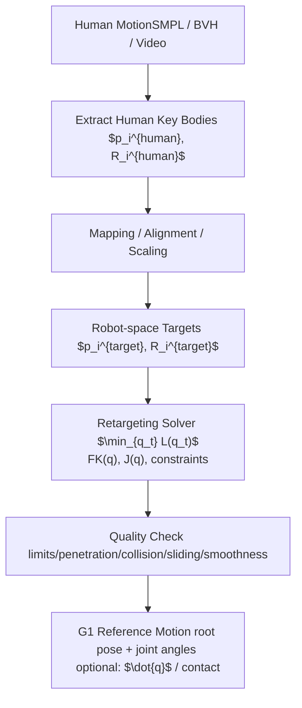

# GMR

## GMR 原理与方法

GMR 的核心原理在于：将人体运动到人形机器人的重定向视为一个先进行人体—机器人关键身体匹配、静止姿态对齐与非均匀局部缩放，再通过两阶段微分逆运动学求解机器人广义坐标的过程。其基本出发点是，PHC 与 ProtoMotions 等方法在源运动缩放阶段容易引入偏离源运动、脚滑、地面穿透与自交等伪影，而缩放策略正是影响重定向质量的关键因素。因此，GMR 并不直接沿用全局统一缩放或简单轴向缩放，而是采用一种简单但灵活的非均匀局部缩放方式，使不同关键身体能够依据其在人体与机器人之间的形态差异分别缩放，并在后续优化中同时兼顾身体朝向、末端执行器位置以及全部关键身体的位置约束，从而在保持源运动忠实性的同时提高机器人运动跟踪策略的可学习性与鲁棒性。

在方法上，GMR 首先要求用户根据源人体骨架与目标人形机器人骨架定义关键身体之间的映射 $\mathcal{M}$，这些关键身体通常包括躯干、头部、腿部、足部、手臂与手部。随后，在人体与机器人均处于静止姿态时，对源人体对应身体的朝向进行偏移，使其与机器人对应身体的朝向一致；在部分情况下，还可对某些身体的位置施加局部偏移，以缓解诸如内八脚等重定向伪影。接着，GMR 对源人体数据进行非均匀局部缩放。其首先依据源人体骨架高度计算一个总体缩放因子，并以此调整每个关键身体各自定义的局部缩放因子，从而能够分别考虑上下肢等不同身体部位之间的缩放差异。目标身体在笛卡尔空间中的位置由下式给出：

$$
\mathbf{p}_{b}^{\mathrm{target}} = \frac{h}{h_{\mathrm{ref}}} s_{b}(\mathbf{p}_{j}^{\mathrm{source}} - \mathbf{p}_{\mathrm{root}}^{\mathrm{source}}) + \frac{h}{h_{\mathrm{ref}}} s_{\mathrm{root}}\mathbf{p}_{\mathrm{root}}^{\mathrm{source}}, 
$$

其中 $h$ 为源人体骨架高度，$h_{\mathrm{ref}}$ 为设定缩放因子时所采用的参考高度，$\mathbf{p}_{b}$ 表示身体位置，$s_{b}$ 为身体 $b$ 对应的缩放因子。当所处理的身体为根节点时，上式退化为：

$$
\mathbf{p}_{\mathrm{root}}^{\mathrm{target}} = \frac{h}{h_{\mathrm{ref}}} s_{\mathrm{root}}\mathbf{p}_{\mathrm{root}}^{\mathrm{source}}.
$$

特别地，根平移采用统一缩放因子进行缩放，对于避免引入脚滑伪影具有关键作用。

在获得目标笛卡尔位置后，GMR 通过求解机器人逆运动学来获得机器人广义坐标 $\mathbf{q}$，其中包括根平移、根旋转与关节值。为避免陷入局部最优，GMR 采用两阶段优化过程。第一阶段仅考虑身体朝向以及末端执行器位置，其优化问题为：

$$
\begin{array}{rl}
\min_{\mathbf{q}} & \sum_{(i, j)\in \mathcal{M}}(w_1)_{i, j}^R\| R_i^b\ominus R_j(\mathbf{q})\| _2^2\\
& +\sum_{(i, j)\in \mathcal{M}}(w_1)_{i, j}^p\| \mathbf{p}_i^{\mathrm{target}} - \mathbf{p}_j(\mathbf{q})\| _2^2
\end{array}
$$

其中，$R_i^b\in SO(3)$ 为人体身体 $i$ 的朝向，$\mathbf{p}_j(\mathbf{q})$ 与 $R_j(\mathbf{q})\in SO(3)$ 分别为通过前向运动学得到的机器人身体 $j$ 的笛卡尔位置与朝向，$R_i\ominus R_j$ 表示二者朝向差的指数映射，$\mathcal{M}_{\mathrm{ee}}$ 为仅包含末端执行器即手与足的关键身体子集，$(w_1)_{i, j}^p$ 与 $(w_1)_{i, j}^R$ 分别为第一阶段的位置与朝向误差权重。$\mathbf{q}$ 中的根位置与根朝向分量由缩放后的根位置 $\mathbf{p}_{\mathrm{root}}^{\mathrm{target}}$ 以及人体根关键身体朝向的偏航分量初始化。该优化受关节上下限 $\mathbf{q}^{-}$ 与 $\mathbf{q}^{+}$ 约束，且在某些情况下需要收紧关节范围以避免非人运动。GMR 使用微分逆运动学求解器 Mink 求解该问题，即不直接寻找使代价最小的 $\mathbf{q}$，而是计算广义速度 $\dot{\mathbf{q}}$，使其积分后能够降低代价：

$$
\begin{array}{rl}
\min_{\mathbf{q}} & \| e(\mathbf{q}) + J(\mathbf{q})\dot{\mathbf{q}}\| _W^2\\
\mathrm{subject~to} & \mathbf{q}^{-}\leq \mathbf{q} + \dot{\mathbf{q}}\Delta t\leq \mathbf{q}^{+}
\end{array}
$$

其中，$e(\mathbf{q})$ 为第一阶段优化中的损失函数，$J(\mathbf{q}) = \frac{\partial e}{\partial \mathbf{q}}$ 为该损失相对于 $\mathbf{q}$ 的雅可比矩阵，$W$ 为由位置与朝向权重诱导得到的权重矩阵，$\Delta t$ 为微分逆运动学求解器的参数。求解过程持续至收敛，即价值函数变化小于阈值 $0.001$，或达到最大迭代次数 $10$。

第二阶段则以第一阶段所得解为初值，进一步使用旋转与平移约束进行微调，其目标函数为：

$$
\begin{array}{rl}
\min_{\mathbf{q}} & \sum_{(i, j)\in \mathcal{M}}(w_2)_{i, j}^R\| R_i^b\ominus R_j(\mathbf{q})\| _2^2\\
& +(w_2)_{i, j}^p\| \mathbf{p}_i^{\mathrm{target}} - \mathbf{p}_j(\mathbf{q}^r)\| _2^2
\end{array}
$$

该阶段采用不同于第一阶段的权重 $(w_2)_{i, j}^p$ 与 $(w_2)_{i, j}^R$，并考虑所有关键身体的位置信息，其终止条件与第一阶段相同。对于运动序列，GMR 将上述单帧重定向方法逐帧顺序应用，并将前一帧的重定向结果作为下一帧第四步优化的初始猜测。当整段运动完成重定向后，再利用前向运动学计算所有机器人身体随时间变化的高度，并将最小高度从全局平移中减去，以修正漂浮或地面穿透等高度伪影。由此，GMR 形成了一套从人体—机器人关键身体匹配、静止姿态对齐、非均匀局部缩放，到两阶段逆运动学优化与序列高度后处理的完整重定向流程。

## Unitree G1 重定向求解流程

### 演示结果

1. 倒着走

<video width="1080" controls src="../public/projects/amp/unitree_g1_B4_-_Stand_to_Walk_backwards_stageii.mp4"></video>

2. 右转弯跑

<video width="1080" controls src="../public/projects/amp/unitree_g1_C14_-__run_turn_right__(90)_stageii.mp4"></video>

3. 不同方向跑

<video width="1080" controls src="../public/projects/amp/unitree_g1_C17_-_run_change_direction_stageii.mp4"></video>

4. 跳步

<video width="1080" controls src="../public/projects/amp/unitree_g1_Run_C25_-_quick_side_step_right_stageii.mp4"></video>

5. 网球发球

<video width="1080" controls src="../public/projects/amp/unitree_g1_hmr4d_results.mp4"></video>
