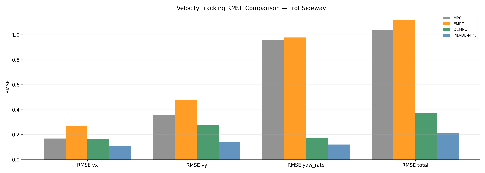
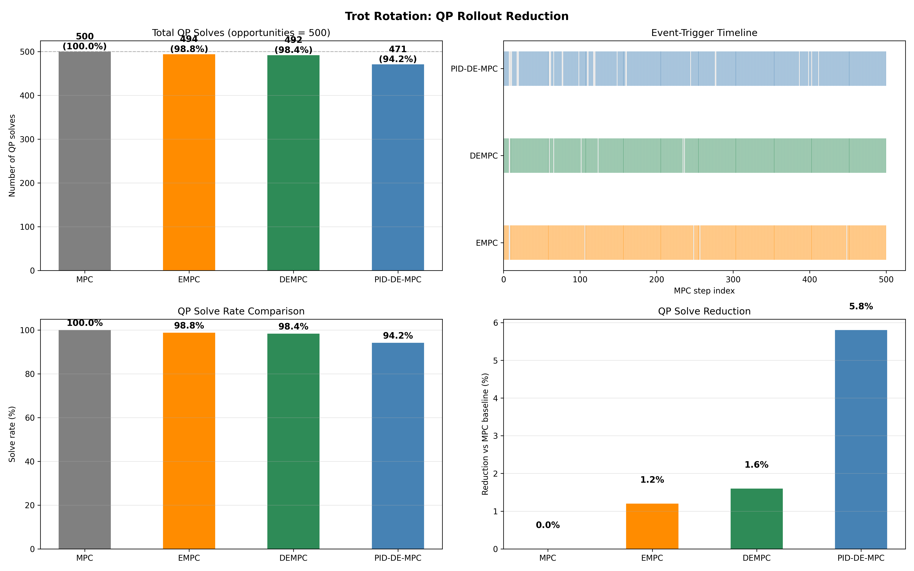
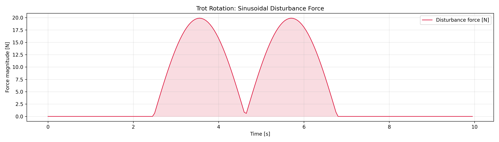
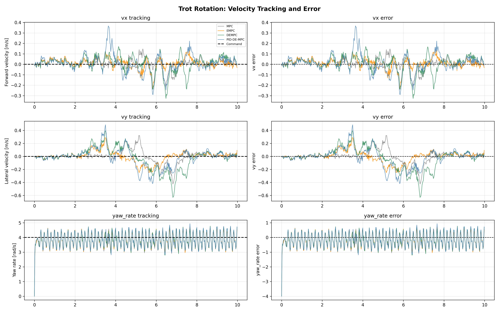
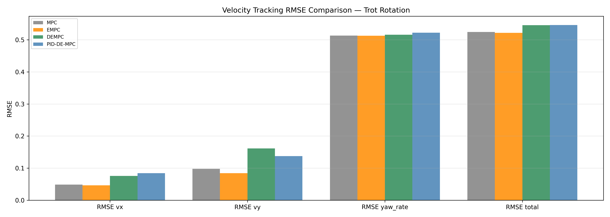

# MPC 四足机器人运动控制

## 一、控制架构

### 1.1 总体框架

四足机器狗的动态运动控制本质上是一个"欠驱动 + 变约束"的高维控制问题：在小跑、跳跃、奔跑等动态步态中，躯干在许多时刻处于欠驱动状态，足端地面反作用力又必须始终位于摩擦锥之内以避免打滑。要在有限的机载算力上实时求解这一问题，通常采用分层（hierarchical）结构，将高维非线性问题分解为若干可解的子问题。

本文的控制架构沿用凸 MPC 框架中的分层思想，共分为五层（图 ** 所示）：**操作员指令层、参考轨迹生成层、MPC 决策层、腿部控制层与状态估计层**。

- **操作员指令层**：通过摇杆或上位机脚本提供期望的前向/侧向速度、偏航角速度和躯干高度等控制指令。为便于操作，所有指令均以机体坐标系给出。
- **参考轨迹生成层**：将操作员指令与预先设定的步态相位结合，生成步态周期内 12 自由度质心状态参考轨迹，同时确定足端落点位置和接触时序。该层由步态生成器负责，其频率与 MPC 决策层同步。
- **MPC 决策层（PID-DE-MPC）**：以当前估计状态为初值，在一个有限长度的滚动时域上求解最优地面反作用力序列，使其尽可能跟踪参考轨迹，同时满足接触与摩擦约束。该层只输出期望的足端接触力，而**不关心腿部构型与形变**，从而将优化问题的复杂度与腿部几何解耦。
- **腿部控制层**：将 MPC 解出的接触力通过雅可比转置映射为关节力矩。对于支撑腿，力矩由反作用力直接计算；对于摆动腿，则采用带前馈的 PD 阻抗控制跟踪足端摆动轨迹。
- **状态估计层**：以高频率（约 1 kHz）融合 IMU 与关节编码器数据，估计躯干位姿、质心速度及关节状态，为 MPC 与腿部控制提供当前状态。

上述分层结构的核心思想是：**用每一层相对简单的模型去捕捉运动中最关键的信息**。MPC 层只需关心质心的合外力与外力矩平衡，腿部层只需关心力—力矩映射，从而避免了在每个控制周期求解非线性动力的优化问题。

### 1.2 状态机与摆动/支撑切换

整个控制系统由一个固定时序的步态状态机驱动：当某条腿被调度为支撑时运行地面力控制器，被调度为摆动时运行摆动腿控制器。摆动腿控制器对提前触地具有一定的鲁棒性——一旦检测到提前接触，立即切换到支撑状态并转入地面力控制。上述"固定触地/离地时序 + 实时接触检测"的机制，使得 MPC 可以离线预知整个预测时域内的接触模式，从而将动力学对接触时序的依赖转化为一个完全确定的问题。

### 1.3 频率与实现

本文各层运算频率如下：参考轨迹与 MPC 决策层运行于约 48 Hz；腿部控制层运行于约 200 Hz；物理仿真与状态估计运行于 1000 Hz。由于 MPC 只求解接触力，其实际计算量由预测时域长度与足端数量决定，而与我们简化模型所忽略的腿部自由度数无关——这正是凸 MPC 能被实时部署的关键所在。

---

## 二、四足机器狗的动力学

### 2.1 刚体简化与坐标系定义

MPC 的核心是一个用于预测的动力学模型。为在实时性、凸性与三维完整性之间取得平衡，本文沿用凸 MPC 中的**单刚体（centroidal）简化**：将四足机器狗视为一个在接触点处受地面反作用力作用的刚体质心系统，而忽略腿部自身的摆动动力学。这一简化对 Go2 是可接受的——机器狗的腿质量仅占总质量的较小比例，质心近似模型已足以刻画系统的主运动模态。

定义世界坐标系（无下标）与机体坐标系（左下标 $\mathcal{B}$）。设机器狗质心位置为 $\mathbf{p}\in\mathbb{R}^3$，质心到第 $i$ 条腿足端的向量为 $\mathbf{r}_i\in\mathbb{R}^3$，第 $i$ 条腿的期望地面反作用力为 $\mathbf{f}_i\in\mathbb{R}^3$。用 $\mathbf{R}$ 表示从机体到世界的旋转矩阵。为便于在优化中处理姿态，姿态采用 **Z-Y-X 欧拉角**表示，即 $\Theta=[\phi,\ \theta,\ \psi]^\mathrm{T}$，其中 $\phi$ 为滚转（roll）、$\theta$ 为俯仰（pitch）、$\psi$ 为偏航（yaw），对应的旋转矩阵为

$$
\mathbf{R} = \mathbf{R}_z(\psi)\,\mathbf{R}_y(\theta)\,\mathbf{R}_x(\phi)
$$

### 2.2 牛顿–欧拉动力学

在世界坐标系下，质心平动与转动满足以下牛顿–欧拉方程：

$$
\ddot{\mathbf{p}} = \frac{\sum_{i=1}^{n}\mathbf{f}_i}{m} - \mathbf{g}
$$

$$
\frac{\mathrm{d}}{\mathrm{d}t}\left(\mathbf{I}\,\boldsymbol{\omega}\right) = \sum_{i=1}^{n}\mathbf{r}_i \times \mathbf{f}_i
$$

$$
\dot{\mathbf{R}} = [\boldsymbol{\omega}]_{\times}\,\mathbf{R}
$$

式中 $m$ 为机器狗总质量，$\mathbf{g}$ 为重力加速度向量，$\mathbf{I}$ 为质心惯量张量，$\boldsymbol{\omega}$ 为机体角速度，$[\mathbf{x}]_{\times}$ 表示以叉乘定义的反对称矩阵。
<!-- 该模型是三维的，但其中（6）和（7）两式的姿态动力学是非线性的，会破坏优化问题的凸性。为此，需要引入如下的小角度近似。 -->

### 2.3 姿态近似

角速度 $\boldsymbol{\omega}$ 与欧拉角导数之间的精确关系为

$$
\boldsymbol{\omega} =
\begin{bmatrix}
\cos\theta\cos\psi & -\sin\psi & 0\\
\cos\theta\sin\psi & \cos\psi & 0\\
-\sin\theta & 0 & 1
\end{bmatrix}
\begin{bmatrix}\dot{\phi}\\ \dot{\theta}\\ \dot{\psi}\end{bmatrix}
$$

当滚转与俯仰角较小（$\cos\theta\neq 0$ 且 $\phi,\theta\to 0$）时，该关系可近似为

$$
\begin{bmatrix}\dot{\phi}\\ \dot{\theta}\\ \dot{\psi}\end{bmatrix}
\approx \mathbf{R}_z^\mathrm{T}(\psi)\,\boldsymbol{\omega}
$$

另一方面，（6）式中的 $\boldsymbol{\omega}\times(\mathbf{I}\boldsymbol{\omega})$ 项刻画了旋转体的进动与章动效应，对于角速度不大的四足机器狗其影响很小，可忽略，从而有

$$
\frac{\mathrm{d}}{\mathrm{d}t}(\mathbf{I}\boldsymbol{\omega}) \approx \mathbf{I}\,\dot{\boldsymbol{\omega}}
$$

在体坐标系下的惯量张量 ${}_\mathcal{B}\mathbf{I}$ 需变换到世界坐标系。对小滚转/俯仰角，可近似为

$$
\hat{\mathbf{I}} \approx \mathbf{R}_z(\psi)\,{}_\mathcal{B}\mathbf{I}\,\mathbf{R}_z^\mathrm{T}(\psi)
$$

### 2.4 连续时间线性时变模型

综合上述近似，定义 12 维状态向量（按实现中使用的顺序排列）：

$$
\mathbf{x} = [p_x,\ p_y,\ p_z,\ \phi,\ \theta,\ \psi,\ v_x,\ v_y,\ v_z,\ \omega_x,\ \omega_y,\ \omega_z]^\mathrm{T}\ \in\mathbb{R}^{12}
$$

其中 $\mathbf{v}=\dot{\mathbf{p}}$ 为质心线速度。控制输入为 4 条腿的 3 维地面反作用力，共 12 维：

$$
\mathbf{u} = [\mathbf{f}_1^\mathrm{T},\ \mathbf{f}_2^\mathrm{T},\ \mathbf{f}_3^\mathrm{T},\ \mathbf{f}_4^\mathrm{T}]^\mathrm{T}\ \in\mathbb{R}^{12}
$$

将状态按位置、姿态、线速度、角速度分块，可写出如下连续时间线性时变（LTV）动力学：

$$
\dot{\mathbf{x}}(t) = \mathbf{A}_c(\psi)\,\mathbf{x}(t) + \mathbf{B}_c(\mathbf{r}_1,\dots,\mathbf{r}_n,\psi)\,\mathbf{u}(t) + \mathbf{g}_c
$$

其中

$$
\mathbf{A}_c =
\begin{bmatrix}
\mathbf{0} & \mathbf{0} & \mathbf{1}_3 & \mathbf{0}\\
\mathbf{0} & \mathbf{0} & \mathbf{0} & \mathbf{R}_z^\mathrm{T}(\psi)\\
\mathbf{0} & \mathbf{0} & \mathbf{0} & \mathbf{0}\\
\mathbf{0} & \mathbf{0} & \mathbf{0} & \mathbf{0}
\end{bmatrix},\qquad
\mathbf{B}_c =
\begin{bmatrix}
\mathbf{0} & \cdots & \mathbf{0}\\
\mathbf{0} & \cdots & \mathbf{0}\\
\frac{1}{m}\mathbf{1}_3 & \cdots & \frac{1}{m}\mathbf{1}_3\\
\hat{\mathbf{I}}^{-1}[\mathbf{r}_1]_{\times} & \cdots & \hat{\mathbf{I}}^{-1}[\mathbf{r}_n]_{\times}
\end{bmatrix}
$$

重力项为 $\mathbf{g}_c = [0,0,0,\ 0,0,0,\ 0,0,-9.81,\ 0,0,0]^\mathrm{T}$。由上式可见，$\mathbf{A}_c$ 和 $\mathbf{B}_c$ **仅依赖于偏航角 $\psi$ 与足端位置 $\mathbf{r}_i$**。若二者可以预先给定，则系统在预测时域内退化为线性时变系统，从而可直接构造凸优化问题。这正是本文能够在保持完整三维动力学的同时，将运控问题转化为凸优化的核心。

### 2.5 离散化

实际控制中需要在离散时间上求解 MPC。本文采用零阶保持（ZOH）将连续模型离散化，得到如下形式：

$$
\mathbf{x}_{k+1} = \mathbf{A}_d\,\mathbf{x}_k + \mathbf{B}_{d,k}\,\mathbf{u}_k + \mathbf{g}_d
$$

其中 $\mathbf{A}_d\in\mathbb{R}^{12\times12}$ 为常值离散状态矩阵，$\mathbf{B}_{d,k}\in\mathbb{R}^{12\times12}$ 为时变离散输入矩阵，$\mathbf{g}_d\in\mathbb{R}^{12}$ 为离散重力向量。具体地，$\mathbf{A}_d$ 在单位矩阵基础上仅保留了位置与速度、姿态与角速度之间的耦合；$\mathbf{B}_{d,k}$ 则按梯形近似将质心运动与足端力矩显著关联。由于 $\mathbf{B}_{d,k}$ 与预测时域、足端位置和偏航角有关，在每个 MPC 周期需重新计算，这也是矩阵动态更新的主要来源。

### 2.6 Go2 平台参数与腿部运动学

本文以 **Unitree Go2** 为实验平台。Go2 是一台 12 自由度的电驱动四足机器狗，每条腿包含 **髋侧摆（abduction）、髋前摆（hip/thigh）、膝（knee）** 三个力矩控制关节，分别对应于近体端的外展/内收、前后摆动与小腿屈伸。其关键动力学参数见表 **。

| 参数 | 符号 | 数值 |
| --- | --- | --- |
| 总质量 | $m$ | ≈ 12 kg |
| 基座惯量 $I_{xx}$ | — | ≈ 0.0245 kg·m² |
| 基座惯量 $I_{yy}$ | — | ≈ 0.0981 kg·m² |
| 基座惯量 $I_{zz}$ | — | ≈ 0.107 kg·m² |
| 摩擦系数 | $\mu$ | 0.8 |
| 腿部自由度 | — | 4 × 3 |
| 站立关节角（髋侧摆/髋前摆/膝） | — | $[0.0,\ 0.9,\ -1.8]$ rad |
| 髋关节力矩上限 | — | ± 23.7 N·m |
| 膝关节力矩上限 | — | ± 45.43 N·m |

在腿部控制层，支撑腿的关节力矩由地面反作用力经雅可比转置得到：

$$
\boldsymbol{\tau}_i = \mathbf{J}_i^\top\,\mathbf{R}_i^\top\,\mathbf{f}_i
$$

式中 $\mathbf{J}_i\in\mathbb{R}^{3\times3}$ 为第 $i$ 条腿足端的雅可比矩阵，$\mathbf{R}_i$ 为从机体到世界的旋转矩阵。对于摆动腿，则采用"反馈 + 前馈"的阻抗跟踪：

$$
\boldsymbol{\tau}_i = \mathbf{J}_i^\top\left[\mathbf{K}_p(\delta\mathbf{p}_{i,\mathrm{ref}}-\delta\mathbf{p}_i)+\mathbf{K}_d(\delta\mathbf{v}_{i,\mathrm{ref}}-\delta\mathbf{v}_i)\right]+\boldsymbol{\tau}_{i,\mathrm{ff}}
$$

其中 $\mathbf{K}_p,\mathbf{K}_d$ 为对角正定增益矩阵，$\delta\mathbf{p},\delta\mathbf{v}$ 为足端在世界系下的位置与速度误差，$\boldsymbol{\tau}_{i,\mathrm{ff}}$ 为前馈力矩。为在较大腿型变化范围内保持高增益稳定，$\mathbf{K}_p$ 的对角元按维持恒定自然频率的原则自适应调节。

---

## 三、基于 MPC 的四足机器狗运控问题

### 3.1 MPC 问题描述

模型预测控制的核心思想是：在每个控制周期，以当前时刻的估计状态为初值，在一个长度为 $k$ 的有限预测时域上，寻找最优的控制输入序列与对应的状态轨迹，使系统在满足约束的前提下尽可能逼近参考轨迹，然后**只施加第一个时间步的控制量**，待下一周期重新测量并重复求解。由于每次都重新求解，滚动时域使控制器具备规划"未来欠驱动飞行阶段"的能力，从而能稳定在任意时刻都可能欠驱动的动态步态。

由于本文直接以**地面反作用力**而非关节力矩为控制量，MPC 无需感知腿部构型或运动学。标准滚动时域 MPC 的通用形式为

$$
\begin{array}{rl}
\displaystyle\min_{\mathbf{x},\mathbf{u}} & \displaystyle\sum_{i=0}^{k-1}\Bigl\|\mathbf{x}_{i+1}-\mathbf{x}_{i+1,\mathrm{ref}}\Bigr\|_{\mathbf{Q}_i} + \Bigl\|\mathbf{u}_i\Bigr\|_{\mathbf{R}_i}\\[2pt]
\text{s.t.} & \mathbf{x}_{i+1} = \mathbf{A}_d\mathbf{x}_i + \mathbf{B}_{d,i}\mathbf{u}_i + \mathbf{g}_d,\quad i=0\dots k-1\\[2pt]
& \underline{\mathbf{c}}_i \le \mathbf{C}_i\mathbf{u}_i \le \overline{\mathbf{c}}_i,\quad i=0\dots k-1\\[2pt]
& \mathbf{D}_i\mathbf{u}_i = 0,\quad i=0\dots k-1
\end{array}
$$

其中 $\mathbf{Q}_i,\mathbf{R}_i$ 为对角半正定的状态误差与力惩罚权重矩阵，$\mathbf{A}_d,\mathbf{B}_{d,i}$ 为离散动力学，$\mathbf{C}_i,\underline{\mathbf{c}}_i,\overline{\mathbf{c}}_i$ 刻画力的不等式约束，$\mathbf{D}_i$ 为选择离地足端并强制其力为零的矩阵。$\|\cdot\|_\mathbf{S}$ 表示加权范数 $\mathbf{a}^\mathrm{T}\mathbf{S}\mathbf{a}$。目标函数在"跟踪精度"与"控制量消耗"之间权衡。当系统因欠驱动或约束而无法精确跟踪参考时，MPC 会在滚动时域内给出最小二乘意义上的最优解。

### 3.2 力约束

约束条件由步态决定，分为等式约束与不等式约束两类。

**等式约束**用于强制**离地的摆动腿**之力为零：

$$
\mathbf{f}_i = \mathbf{0},\quad \text{当腿 } i \text{ 处于摆动相}
$$

**不等式约束**用于对每条**支撑腿**施加六条约束，其一是对垂向力的上下界限制，其二是对摩擦锥的方形金字塔近似：

$$
\begin{array}{rl}
& f_{\min} \le f_z \le f_{\max}\\
& -\mu f_z \le f_x \le \mu f_z\\
& -\mu f_z \le f_y \le \mu f_z
\end{array}
$$

其中 $\mu$ 为摩擦系数（Go2 取 0.8），$f_{\min}$ 为保证足端不打滑而设置的垂向力下限（取 10 N），$f_{\max}$ 为足端反作用力上限。摩擦金字塔将非线性摩擦锥线性化为凸多边形，从而保持问题的凸性。

### 3.3 参考轨迹生成

参考轨迹由操作员的期望行为构造。本文的参考轨迹较为简单，仅包含非零的 $xy$ 方向速度、$xy$ 方向位置、$z$ 方向位置、偏航角与偏航角速度；其余状态（滚转、俯仰及其角速度、$z$ 方向速度）恒设为零。偏航角与 $xy$ 位置由相应的速度积分得到。参考轨迹还用于确定动力学约束与后续的足端落点位置。

在工程实现中，参考轨迹较短（约为一个步态周期），且被频繁更新，以保证当机器狗受到扰动而偏离参考时，简化动力学仍能保持足够精度。**这揭示了一个重要认识**：在预测时域内保持动力学模型的精确性，远不如保证**瞬时动力学**的精确性关键。通过在扰动后及时重算模型（最迟 40 ms），MPC 能够有效补偿外部扰动。

步态触地时序由高层步态生成器给出。本文的仿真采用 **3 Hz 小跑**步态、0.6 占空比，即一个步态周期约 0.333 s，并将其划分为 $N=16$ 个时间步，MPC 求解频率约为 48 Hz。足端水平落点由拉伊伯特式启发规则给出：

$$
\mathbf{p}^{\mathrm{des}} = \mathbf{p}^{\mathrm{ref}} + \mathbf{v}^{\mathrm{CoM}}\,\Delta t / 2
$$

式中 $\Delta t$ 为足端预计触地时长，$\mathbf{p}^{\mathrm{ref}}$ 为髋部正下方地面的位置，$\mathbf{v}^{\mathrm{CoM}}$ 为质心在 $xy$ 平面上的投影速度。该方法同时被摆动腿控制器与 MPC（用于确定 $\mathbf{r}_i$）使用。

### 3.4 QP 的构造与求解

将目标函数展开并整理，MPC 问题可化为一个稀疏二次规划（QP）：

$$
\min_{\mathbf{z}}\quad \frac{1}{2}\mathbf{z}^\mathrm{T}\mathbf{H}\mathbf{z} + \mathbf{g}^\mathrm{T}\mathbf{z}
\quad \text{s.t.}\quad \underline{\mathbf{c}} \le \mathbf{C}\mathbf{z} \le \overline{\mathbf{c}},\ \ \underline{\mathbf{x}} \le \mathbf{z} \le \overline{\mathbf{x}}
$$

其中决策变量 $\mathbf{z}$ 堆叠了整个预测时域上的状态轨迹与接触力序列。$\mathbf{H}$ 为对角矩阵，其对角元由状态权重 $\mathbf{Q}$ 与力权重 $\mathbf{R}$ 构成（取 $2\mathbf{Q}$ 与 $2\mathbf{R}$），线性项 $\mathbf{g}$ 中则包含 $-\mathbf{Q}\mathbf{x}_{\mathrm{ref}}$ 的贡献，用以将目标函数改写为"对参考的加权最小二乘偏差 + 力惩罚"的紧凑形式。约束 $\mathbf{C}$ 中同时包含动力学等式约束（将相邻时刻状态联系）、摩擦锥的不等式约束；接触为零与垂向力下限则通过盒式约束（box constraints）实现。该稀疏形式未显式消去状态变量，保留了问题结构，由 **OSQP** 经由 CasADi 的锥优化接口高效求解。由于 $\mathbf{H}$ 与 $\mathbf{g}$ 的规模仅取决于足端数量与预测时域长度，而与状态维数无关，因此整个优化问题可以在机载平台上实时完成。

### 3.5 PID-DE-MPC：事件触发与扰动抑制

标准 MPC 在每个控制周期都求解一次 QP，这给机载嵌入式处理器带来了沉重的计算负担（尤其在 30–50 Hz 的求解频率下）。本文采用 **PID-DE-MPC**，通过"事件触发复用 + ESO 抗扰补偿"两条途径在保持鲁棒性的同时显著降低在线求解量。

（1）**PID 型事件触发机制。**控制器缓存上一次 MPC 求解得到的预测状态轨迹 $\mathbf{x}_b$ 与控制序列 $\mathbf{u}_b$。在每个周期计算当前状态与缓存轨迹之间的预测误差：

$$
\mathbf{e}_k = \mathbf{x}_k - \mathbf{x}_b[:,t_k]
$$

基于该误差构造一个 PID 型触发信号——分别利用误差幅值的**比例项**、误差随时间的**积分项**与**微分（变化率）项**：

$$
J_{\mathrm{PID}} = e^{K_p}\|\mathbf{e}\| + e^{K_i}\,J_i + e^{K_d}\,\frac{\mathrm{d}\|\mathbf{e}\|}{\mathrm{d}t}
$$

其中 $J_i$ 为误差积分项，$K_p,K_i,K_d$ 为 PID 触发增益，$\delta$ 为触发阈值（综合幅值与灵敏度设置）。当 $J_{\mathrm{PID}} < \delta$ 且预测时域尚有剩余时，说明当前状态仍忠实落在上一次预测的轨迹附近，此时**将上一次的解向前平移一步并复用**，而不必重新求解 QP；否则才重新求解 MPC，并重置积分项与触发时刻 $t_k$。与固定阈值的事件触发（EMPC）相比，PID 机制使阈值随误差的"幅值—累积—变化率"动态调节，从而更智能地权衡计算量与跟踪精度。

（2）**扩张状态观测器（ESO）抗扰补偿。**为增强对外部扰动（如踢击、地形不平、打滑）的鲁棒性，本文在速度通道上设计一个 6 自由度的 ESO，用于实时估计作用在质心上的等效扰动力/力矩：

$$
\begin{array}{l}
\hat{\mathbf{v}} \leftarrow \hat{\mathbf{v}} + T_s\bigl(\beta_1(\mathbf{v}-\hat{\mathbf{v}})+\hat{\mathbf{d}}\bigr)\\[2pt]
\hat{\mathbf{d}} \leftarrow \hat{\mathbf{d}} + T_s\,\beta_2(\mathbf{v}-\hat{\mathbf{v}})
\end{array}
$$

其中 $\mathbf{v}$ 为实测线/角速度，$\hat{\mathbf{v}}$ 与 $\hat{\mathbf{d}}$ 分别为估计速度与扰动，$\beta_1=2w_0,\ \beta_2=w_0^2$ 由观测器带宽 $w_0$ 决定。估计的扰动 $\hat{\mathbf{d}}$ 经低通滤波得到补偿量 $\mathbf{d}_{\mathrm{comp}}$，并在 MPC 第一个时间步按简比分配给各支撑腿的接触力：

$$
\mathbf{u} = \mathbf{u}_{\mathrm{MPC}} - \mathbf{d}_{\mathrm{comp}}
$$

ESO 无需精确建模外部扰动，而是把模型失配与未知外扰统一当作"总扰动"进行观测与补偿，从而显著提升抗扰能力，这也是"抗扰 MPC"一名的来源。

综上，PID-DE-MPC 在一个控制周期内的决策流程为：更新 ESO 得到扰动估计 $\to$ 计算预测误差与触发信号 $J_{\mathrm{PID}}$ $\to$（依据触发条件）求解或复用一次 MPC 解 $\to$ 将扰动前馈补偿叠加到首个时间步的接触力上 $\to$ 施加控制并进入下一周期。其工作流程如图 ** 所示。通过这一机制，在保持跟踪精度的前提下，QP 求解次数被大幅削减。

---

## Unitree Go2机器人

### 物理参数

Go2 是一款12自由度的电驱动四足机器人。URDF模型位于 `models/URDF/go2_description/` 。通过Pinocchio提取的关键参数：

| 参数 | 符号 | 数值 |
| --- | --- | --- |
| 总质量 | $m$ | ~12 kg |
| 基座惯量 (xx) | $I_{xx}$ | 0.0245 kg·m² |
| 基座惯量 (yy) | $I_{yy}$ | 0.0981 kg·m² |
| 基座惯量 (zz) | $I_{zz}$ | 0.107 kg·m² |
| 摩擦系数 | $\mu$ | 0.8 |
| 腿数 | — | 4 |
| 每条腿关节数 | — | 3 (髋侧摆、髋前摆、膝) |

### 状态空间模型

质心动力学以零阶保持器在时间步长 $\Delta t$ 下离散化：

$$
\mathbf{x}_{k+1} = \mathbf{A}_d\, \mathbf{x}_k + \mathbf{B}_{d, k}\, \mathbf{u}_k + \mathbf{g}_d
$$

其中 $\mathbf{A}_d \in \mathbb{R}^{12\times 12}$ 为（常值）离散时间状态矩阵，$\mathbf{B}_{d, k} \in \mathbb{R}^{12\times 12}$ 为时变输入矩阵（依赖于足端位置和偏航角），$\mathbf{g}_d \in \mathbb{R}^{12}$ 为离散重力向量。

**状态向量**（12自由度）：

$$
\mathbf{x} = [p_x, p_y, p_z, \ \phi, \theta, \psi, \ v_x, v_y, v_z, \ \omega_x, \omega_y, \omega_z]^T
$$

**控制输入**（12个力，每条腿3个）：

$$
\mathbf{u} = [f_{FL, x}, f_{FL, y}, f_{FL, z}, \ f_{FR, x}, f_{FR, y}, f_{FR, z}, \ f_{RL, x}, f_{RL, y}, f_{RL, z}, \ f_{RR, x}, f_{RR, y}, f_{RR, z}]^T
$$

**腿部构型**（站立姿态）：每条腿初始关节角度为 `[0.0, 0.9, -1.8]` rad（髋侧摆、髋前摆、膝）。

## 实验结果

我们在MuJoCo物理仿真中对四种控制器在三种运动场景下进行了对比。每个场景运行10秒，使用3 Hz小跑步态（0.6占空比）。MPC以48 Hz运行（步态周期 / 16），腿部控制器以200 Hz运行，物理仿真以1000 Hz运行。仿真中施加随机脉冲踢击扰动（2–3次，70–100 N 侧向力，0.03 s 持续时间），用于测试抗扰能力。

### 前向小跑 — 0.5 m/s

| 控制器 | 求解次数 | 求解率 | 缩减 | RMSE_vx | RMSE_vy | RMSE_yaw | RMSE_total |
| --- | --- | --- | --- | --- | --- | --- | --- |
| **MPC** | 500 | 100.0% | — | 0.1152 | 0.1051 | 0.0885 | 0.1793 |
| **EMPC** | 421 | 84.2% | 15.8% | 0.1190 | 0.1008 | 0.0993 | 0.1849 |
| **DEMPC** | 439 | 87.8% | 12.2% | 0.0962 | 0.1390 | 0.1073 | 0.2003 |
| **PID-DE-MPC** | 382 | 76.4% | 23.6% | 0.0804 | 0.1096 | 0.1047 | 0.1716 |

PID-DE-MPC 以最低的RMSE（0.1716）将QP求解次数减少23.6%。

<video width="1024" controls src="../public/projects/mpc/ex11_pid_de_mpc.mp4"></video>

### 侧向小跑 — 0.4 m/s 侧向

| 控制器 | 求解次数 | 求解率 | 缩减 | RMSE_vx | RMSE_vy | RMSE_yaw | RMSE_total |
| --- | --- | --- | --- | --- | --- | --- | --- |
| **MPC** | 500 | 100.0% | — | 0.1692 | 0.3551 | 0.9616 | 1.0389 |
| **EMPC** | 494 | 98.8% | 1.2% | 0.2655 | 0.4745 | 0.9777 | 1.1187 |
| **DEMPC** | 490 | 98.0% | 2.0% | 0.1683 | 0.2791 | 0.1763 | 0.3705 |
| **PID-DE-MPC** | 451 | 90.2% | 9.8% | 0.1087 | 0.1385 | 0.1208 | 0.2135 |

PID-DE-MPC 以最低的RMSE（0.2135）将QP求解次数减少9.8%。

<video width="1024" controls src="../public/projects/mpc/ex12_pid_de_mpc.mp4"></video>

### 旋转小跑 — 4.0 rad/s 偏航

| 控制器 | 求解次数 | 求解率 | 缩减 | RMSE_vx | RMSE_vy | RMSE_yaw | RMSE_total |
| --- | --- | --- | --- | --- | --- | --- | --- |
| **MPC** | 500 | 100.0% | — | 0.0507 | 0.0898 | 0.4916 | 0.5023 |
| **EMPC** | 494 | 98.8% | 1.2% | 0.0463 | 0.0844 | 0.5128 | 0.5218 |
| **DEMPC** | 492 | 98.4% | 1.6% | 0.0758 | 0.1614 | 0.5158 | 0.5458 |
| **PID-DE-MPC** | 471 | 94.2% | 5.8% | 0.0840 | 0.1374 | 0.5219 | 0.5462 |

PID-DE-MPC 将QP求解次数减少5.8%，RMSE基本持平（0.5462 vs 0.5023）。

<video width="1024" controls src="../public/projects/mpc/ex13_pid_de_mpc.mp4"></video>

